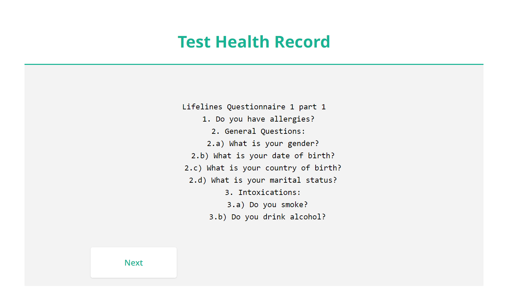
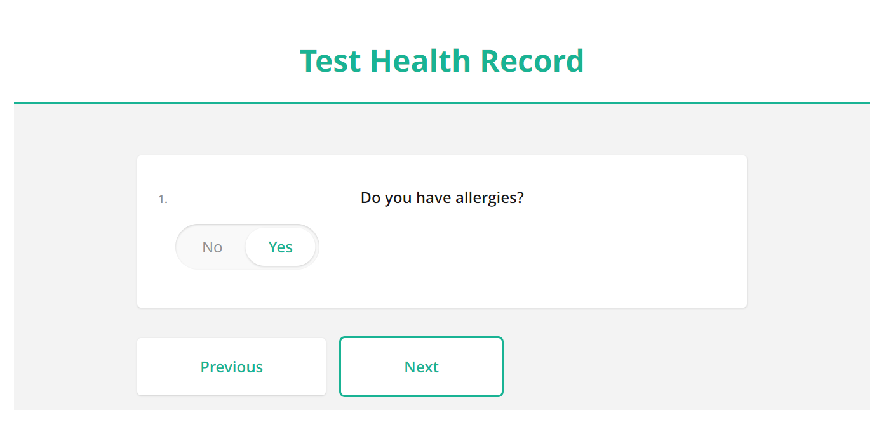
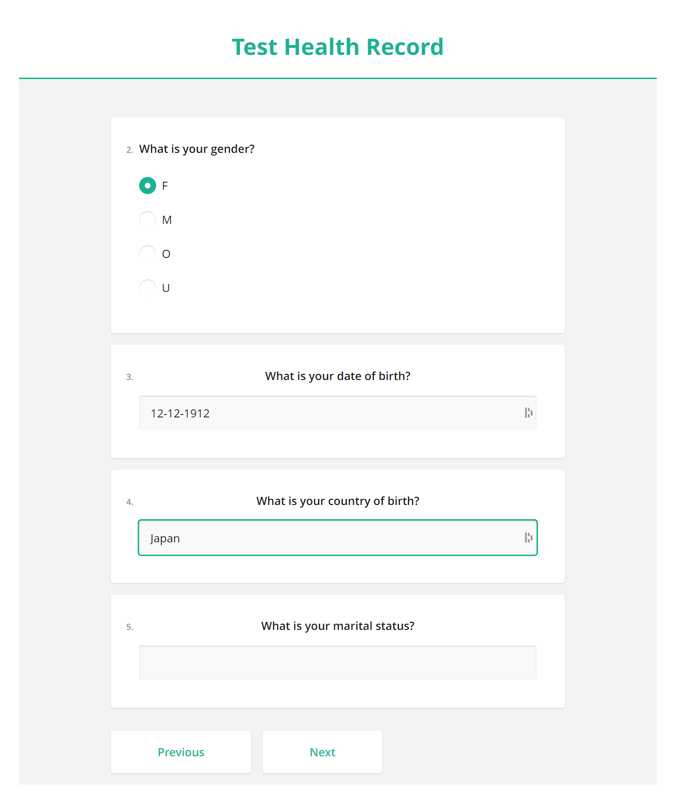
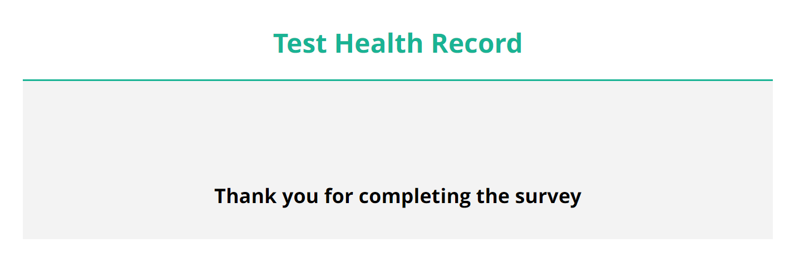

## What is this?

WIP
Goal: convert FHIR Questionnaire Resource to a json object that can be processed by SurveyJS

## Server

If you haven't already, install go

> cd server && bash server.sh

## client

> cd client

> yarn install

> yarn dev

